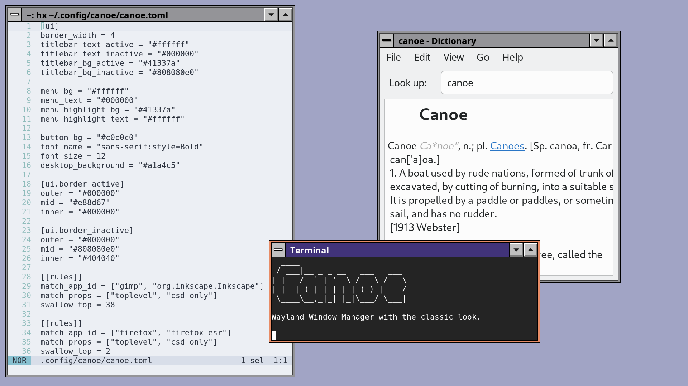

# Canoe 🛶 - River Window Manager



A stacking window manager for the River Wayland compositor, written in Rust.

## Features

- Stacking window management
- Server-side decorations with classic window borders & titlebars
- Titlebar/edge window movement and resizing (Super+Drag anywhere)
- Multihead support (focus/send windows across outputs)
- Window switcher (keyboard cycle + desktop right-click menu)
- Window focus follows click
- Minimized windows shown as icons on the desktop (can be disabled)
- Optional forcing server-side decorations via per-window rules
- Optional "swallowing" of client-side decoration via per-window rules

## Installation

```bash
cargo install canoe
```

## Running

```bash
river -c canoe
```

## Building From Source

```bash
cargo build --release
```


## Keyboard Shortcuts

| Shortcut | Action |
|----------|--------|
| `Super+Shift+Return` | Open terminal (foot) |
| `Super+Space` | Open application launcher (fuzzel) |
| `Super+l` | Lock the screen (swaylock) |
| `Super+w` | Close focused window |
| `Super+Tab` | Focus next window |
| `Super+Shift+Tab` | Focus previous window |
| ``Super+` `` | Focus next window of the same application |
| `Super+Enter` | Toggle fullscreen |
| `Super+Down` | Unfullscreen/unmaximize, otherwise minimize focused window |
| `Super+Up` | Maximize focused window |
| `Super+h` | Minimize focused window |
| `Super+m` | Minimize focused window |
| `Super+Left` | Snap focused window to left half; restore if snapped right |
| `Super+Right` | Snap focused window to right half; restore if snapped left |
| `Super+Alt+Left` | Send focused window to previous output |
| `Super+Alt+Right` | Send focused window to next output |
| `Super+Alt+Up` | Send focused window to previous output |
| `Super+Alt+Down` | Send focused window to next output |
| `Super+1` ... `Super+9` | Switch current output to workspace 1-9 |
| `Super+Shift+1` ... `Super+Shift+9` | Send focused window to workspace 1-9 |

## Mouse Actions

| Action | Result |
|--------|--------|
| Click on window | Focus window |
| Drag titlebar | Move window |
| Drag window edges | Resize window |
| `Super+Left Drag` | Move window (anywhere) |
| `Super+Right Drag` | Resize window (anywhere) |

## Configuration

Canoe reads `~/.config/canoe/canoe.toml`. After editing it, send `SIGHUP` to
re-read it without restarting (e.g. `pkill -HUP canoe`); this refreshes the
theme, desktop, window rules, and key bindings. Pass `--no-config` to ignore the
file and use the built-in defaults (reloads keep honoring this).

The main modifier defaults to `super`, but you can change it:

```toml
main_modifier = "alt"
```

The launcher defaults to `fuzzel`. You can override it with a command or argv:

```toml
launcher_cmd = "fuzzel"
# Or with arguments:
launcher_cmd = ["fuzzel", "--dmenu"]
```

The terminal defaults to `foot`. Override it the same way:

```toml
terminal_cmd = "alacritty"
# Or with arguments:
terminal_cmd = ["wezterm", "start"]
```

The screen locker defaults to `swaylock`. Override it the same way:

```toml
lock_cmd = "swaylock"
# Or with arguments:
lock_cmd = ["swaylock", "-f", "-c", "000000"]
```

### Hotkeys

Bind arbitrary key chords to commands under the `[hotkeys]` table. Each key is a
`+`-separated chord (modifiers first, the key last); each value is the command to
spawn, given as a string that is split on whitespace into program + arguments:

```toml
[hotkeys]
"Super+I"       = "control-panel"
"Super+P"       = "control-panel -m display"
"Super+Shift+T" = "foot"
```

If an argument itself contains spaces, use the array form instead, which is
taken verbatim as the argv (no splitting):

```toml
"Super+E" = ["sh", "-c", "notify-send 'hi there' && foot"]
```

Recognized modifiers are `super` (aliases `logo`/`win`/`mod4`), `alt` (`mod1`),
`ctrl`/`control`, `shift`, `mod3`, and `mod5`. Keys are named by their XKB keysym
(`i`, `Return`, `space`, `F5`, `XF86AudioRaiseVolume`, …), matched
case-insensitively — so `Super+I` triggers on the physical `I` key; add `Shift`
explicitly if you mean the shifted chord. A hotkey naming the same chord as a
built-in shortcut overrides it.

Edits to `[hotkeys]` (and `main_modifier`) take effect on the next `SIGHUP`
reload — no restart needed; canoe rebinds every seat's shortcuts.

### UI Settings

UI options live under the `[ui]` table and let you tune borders, titlebars, and menu colors.
Colors accept `#RGB`, `#RRGGBB`, or `#RRGGBBAA`.

```toml
[ui]
border_width = 10
border_active = { outer = "#FFD000", mid = "#000000", inner = "#FFD000" }
border_inactive = { outer = "#000000", mid = "#000000", inner = "#000000" }
titlebar_text_active = "#000000"
titlebar_text_inactive = "#808080"
titlebar_bg_active = "#FFD000"
titlebar_bg_inactive = "#202020"
menu_bg = "#000000"
menu_text = "#FFFFFF"
menu_highlight_bg = "#FFD000"
menu_highlight_text = "#000000"
button_bg = "#202020"
button_highlight = "#FFD000"
button_shadow = "#000000"
shadows_enabled = true          # master toggle; when false menus fall back to a flat L-shape
shadows_active_size = 20        # soft shadow size for the focused window (and menus)
shadows_inactive_size = 10      # soft shadow size for non-focused windows
shadows_color = "#00000033"     # shadow color used for the soft drop shadow
font_name = "Sans"
font_size = 12.0
desktop_background = "#101010"
icons_enabled = true            # set to false to hide minimized-window icons on the desktop
icons_font_name = "Sans"        # optional; defaults to a regular-weight variant of font_name
icons_font_size = 10.0          # optional; defaults to font_size * 0.80
icons_text = "#FFFFFF"          # optional; defaults to menu_text
icons_highlight_bg = "#FFD000"  # optional; defaults to menu_highlight_bg
icons_highlight_text = "#000000"# optional; defaults to menu_highlight_text
```

### Rule Matching

Rules live under `[[rules]]` in `canoe.toml`. App ID matching uses OR across the
app-id fields, and property matching uses AND across the listed properties.

```toml
[[rules]]
match_app_id = ["foot", "kitty"]   # exact match, any value matches
match_app_id_prefix = "mate-"      # prefix match (e.g. mate-calc)
match_props = ["toplevel", "csd_only"] # all props must match
```

Supported `match_props` values:
- `toplevel` (window has no parent)
- `csd_only` (client does not support SSD)

The matching windows can have parts of their content "swallowed". This removes
the client-side decoration on my Firefox, for instance:

```toml
match_app_id = "firefox-esr"
match_props = "toplevel"
force_ssd = true
swallow_top = 48
```

## Requirements

- [River](https://codeberg.org/river/river) Wayland compositor
- foot terminal (for Super+Shift+Return)
- fuzzel (for Super+Space launcher)
- swaylock (for Super+L screen lock)

## License

MIT
